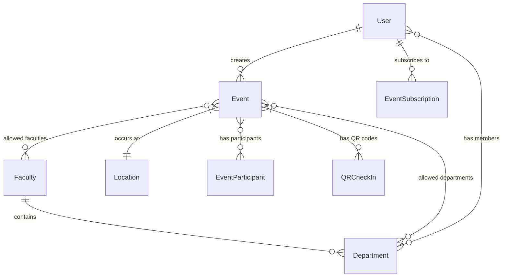

# Event Management Model 

Data models used for campusuniverse event management.

## Features

- **Role-based Access Control**: Users can be students, lecturers, staff, or admins.
- **Event Management**: Schedule events with configurable visibility (public, department/faculty-restricted, or private).
- **Multi-layered Organization**: Hierarchical structure with `Faculties > Departments > Users`.
- **Event Subscriptions**: Users can subscribe to event notifications.
- **QR Code Check-ins**: Secure event participation verification with optional manual override.
- **Location Tracking**: Events are mapped to physical locations with GPS coordinates.
- **Event Status Tracking**: Track events as scheduled, ongoing, completed, cancelled, or postponed.

## Data Model

### Enumerations
| Name             | Values                                                                 |
|------------------|-----------------------------------------------------------------------|
| `Role`           | STUDENT, LECTURER, STAFF, ADMIN                                       |
| `Part`           | ONE, TWO, THREE, FOUR, FIVE (e.g., academic year divisions)           |
| `EventVisibility`| PUBLIC, DEPARTMENT[], FACULTY[], PART[], PRIVATE                      |
| `EventCategory`  | LECTURE, WORKSHOP, MEETING, SPORTS, CULTURAL, EXAM, HOLIDAY           |
| `EventStatus`    | SCHEDULED, ONGOING, COMPLETED, CANCELLED, POSTPONED                   |
| `CheckInMethod`  | QR_CODE, MANUAL_OVERRIDE                                              |

### Entity Relationships

#### Key Entities
- **User**: Central actor with role-based permissions (`STUDENT`, `LECTURER`, etc.).
- **Event**: Core entity with visibility rules, category, status, and location mapping.
- **Location**: Physical spaces with GPS coordinates for event geolocation.
- **EventParticipant**: Tracks user attendance and verification method (QR/manual).
- **QRCheckIn**: Stores time-sensitive QR codes for event check-ins.

## Acknowledgments
- Mermaid.js for diagram support
